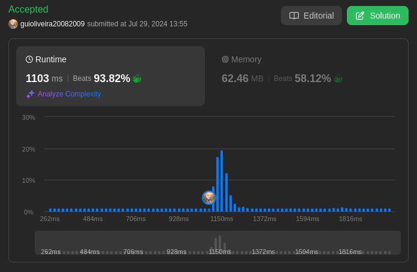
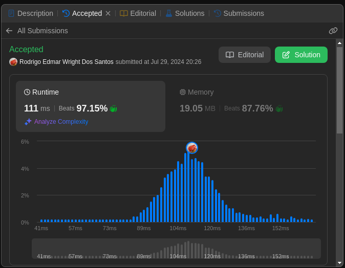
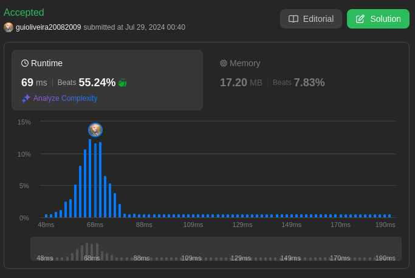
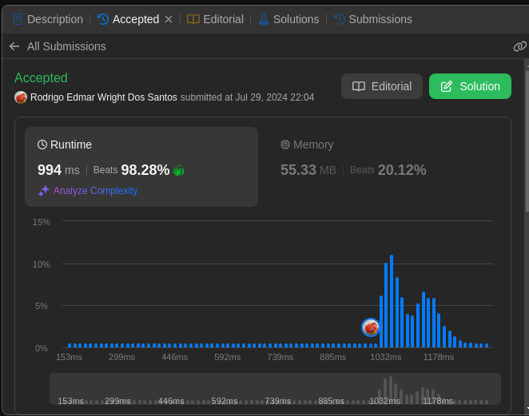

# LeetCode Problems

**Número da Lista**: 17  
**Conteúdo da Disciplina**: Algorítimos Ambiciosos 

## Alunos
|Matrícula | Aluno |
| -- | -- |
| 20/0027158  |  Rodrigo Edmar Wright Dos Santos |
| 18/0113496  |  Guilherme de Oliveira Mendes |

## Sobre 
Neste projeto, será abordado alguns problemas disponíveis na plataforma [LeetCode](https://leetcode.com/) sobre algorítimos ambiciosos. Sendo que os problemas apresentados serão resolvidos utilizando conceitos apredidos em sala de aula e em pesquisas.

## Screenshots
[Difícil: 2402. Meeting Rooms III](https://leetcode.com/problems/meeting-rooms-iii/description/) 

[Difícil: 135. Candy](https://leetcode.com/problems/candy/submissions/1337823294/) 

[Média: 1094. Car Pooling](https://leetcode.com/problems/car-pooling/description/) 

[Média: 435. Non-overlapping Intervals](https://leetcode.com/problems/non-overlapping-intervals/description/) 

## Instalação 
**Linguagem**: Python3    
**Framework**: Não 
**Pré-requisito**: Compilador de Python3.

## Link da Apresentação
[Apresentação PA 17 - LeetCode Problems - Algoritmos Ambiciosos](https://youtu.be/s4A41QwdDY0) 

